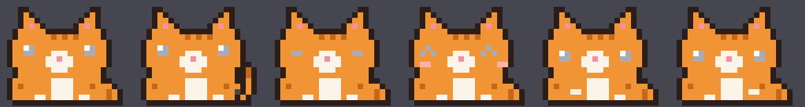
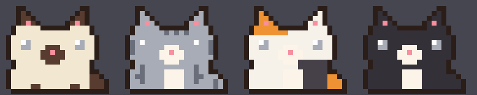
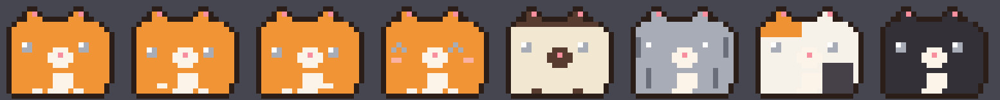

# FunnyPets 🐈🐹

Пиксельные питомцы (кот и хомяк), которые живут на рабочем столе.
macOS — нативное приложение **ComNyan.app** (Swift/AppKit),
Linux (Debian 13+) — порт на Python/GTK в [linux/](linux/).
Вдохновлено [comnyang.com](https://comnyang.com/en).





## Функции (паритет с оригиналом)

| # | Функция | Как работает |
|---|---------|--------------|
| 1 | Окрас | 5 цветов + сиамский/полосатый/калико/смокинг + импорт JSON с comnyang.com + свой PNG |
| 2 | Слежение глазами | Глаза следят за курсором |
| 3 | Моти-драг | Тащи мышкой — тянется и желейно колышется |
| 4 | Охота за курсором | Быстро двигай мышь — кот пригнётся и догонит курсор серией прыжков |
| 5 | Мурчание | Погладь по голове туда-сюда — мурчит, сердечки, румянец |
| 6 | Месит лапками | При печати |
| 7 | Перегрев | Быстрая печать — краснеет, пар из головы |
| 8 | Разминка | Периодически растёт и просит потянуться |
| 9 | Бумага | При скролле разматывает рулон бумаги |
| 10 | Агент думает | Claude Code работает — кот «думает» (точки над головой) |
| 11 | Агент закончил | Прыжок + «Мяу!» + звук |
| 12 | Помодоро | 25+5 или 50+10, таймер над головой |
| 13 | Напоминания | Время + текст, кот мяукнет |
| 14 | Заметка | Закреплённый текст над головой |
| 15 | Имена | Кот зовёт тебя по имени; у кота своя табличка с именем |
| 16 | Peek-режим | Перетащи кота за край экрана — спрячется, клик — выглянет (или через меню) |
| 17 | Прогулки | Раз в несколько минут кот сам прогуливается по экрану прыжками |
| 18 | Время суток | Утром здоровается и тянется, ночью раньше засыпает |
| 19 | Праздники | Шапка Санты (15 дек–7 янв) и ведьминская шляпа (24–31 окт) автоматически |
| 20 | Хомяк | Меню → Питомец → Хомяк 🐹; щёчки надуваются, пока печатаешь |

Меню: правый клик по коту или пиксельная мордочка в статус-баре.

## Свой окрас

Два способа через меню → Окрас → «Импорт окраса (JSON/PNG)…»:

1. **JSON с [comnyang.com/showcase](https://comnyang.com/en/showcase)** — скачай
   пресет, импортируй. Сетка у оригинала другая, поэтому маппинг семантический:
   базовый цвет → тело, голова → мордочка, лапы → лапы, живот → живот,
   розовый нос → нос. Имя кота подхватывается из файла. PNG с сайта — это
   просто рендер их кота, для импорта не годится.
2. **Свой PNG-шаблон**: «Сохранить шаблон PNG…» → раскрась в любом редакторе
   (сетка 24×19, экспортируется в ×10) → импортируй обратно. Прозрачные
   пиксели остаются цветом по умолчанию.

На тёмных окрасах глаза автоматически рисуются светлыми с зрачком.

## Интеграция с Claude Code

Hooks в `~/.claude/settings.json` пишут состояние в `~/.comnyan/agent`:
`UserPromptSubmit` → `thinking`, `Stop` → `done`. Кот читает файл сам.
Любой другой инструмент можно подключить так же — просто пиши
`thinking`/`done` в этот файл.

## Сборка (macOS)

```sh
./build.sh          # соберёт ComNyan.app
open ComNyan.app
```

Нужны только Xcode Command Line Tools (swiftc). Без зависимостей, без телеметрии.

## Linux (Debian 13+)

```sh
sudo apt install python3-gi gir1.2-gtk-3.0 libxss1
python3 linux/funnypets.py
```

Подробности и ограничения — в [linux/README.md](linux/README.md).

## Файлы

- `Sources/main.swift` — всё macOS-приложение (AppKit)
- `Sources/CatFrames.swift` — спрайты и окрасы (генерируются)
- `sprites.py` — редактор пиксель-арта: правишь кадры → `python3 sprites.py` → `./build.sh`.
  Генерирует и Swift-спрайты, и `linux/sprites.json` — источник один
- `linux/funnypets.py` — Linux-порт (GTK3)
- `preview*.png` — превью кадров, окрасов и хомяка

## Отладка

`COMNYAN_SNAPSHOT=/tmp/x ./ComNyan.app/Contents/MacOS/ComNyan` — через
1.5 с сохранит рендер кота и пузыря в `/tmp/x-cat.png` / `/tmp/x-bubble.png`.
